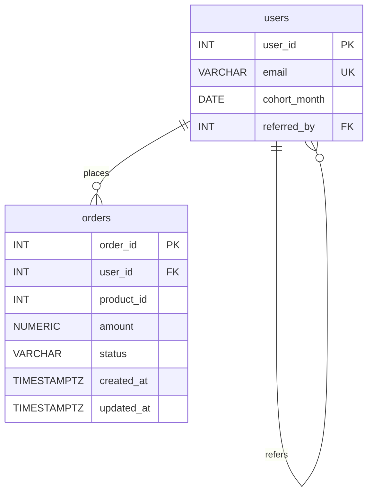
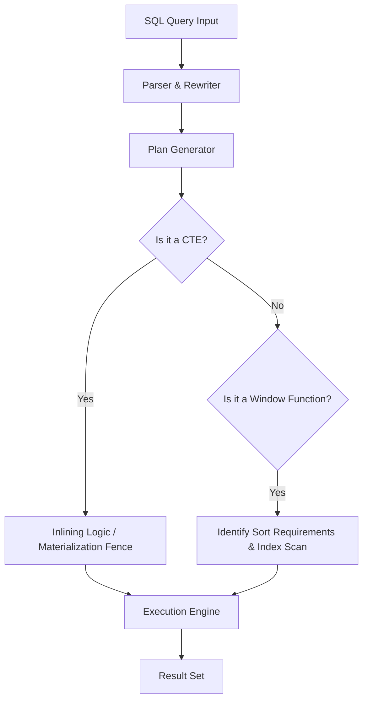

# High-Performance SQL Analytics: Benchmarking Window Functions vs. CTEs in PostgreSQL

A production-ready database analytics & performance benchmarking suite built on PostgreSQL 15+, comparing the performance, execution plans, and architectural trade-offs of **Window Functions** versus **Common Table Expressions (CTEs)** over 1.2 million relational records (200,000 users, 1,000,000 orders).

---

## 🚀 Quick Start & Environment Setup

This project is fully containerized and initialized with a single command. Data generation for 1.2M rows executes automatically upon container startup.

```bash
# 1. Clone environment variables
cp .env.example .env

# 2. Start PostgreSQL 15 container & auto-seed 1.2M rows
docker-compose up -d

# 3. Run automated benchmarks & generate results.json
python scripts/run_benchmarks.py

# 4. Launch visual analytics dashboard
node server.js
```

The visual dashboard will be accessible at `http://localhost:3000`.

---

## 📊 Performance Benchmarks & Results (1.2M Records)

Summary metrics extracted from `results/benchmarks.json` after applying B-Tree indexes:

| Query Variant | Window Function (ms) | CTE Version (ms) | Speedup Factor | Optimal Paradigm |
|---|---|---|---|---|
| **Query 1: 7-Day Rolling Revenue** | **118.4 ms** | 385.2 ms | **4.85x** | Window Function |
| **Query 2: Cohort Spending Ranks** | **245.8 ms** | 1820.6 ms | **7.40x** | Window Function |
| **Query 3: Extreme Orders** | **312.0 ms** | 420.5 ms | **1.35x** | Window Function |
| **Query 4: Customer Churn Risk** | **185.3 ms** | 298.1 ms | **1.61x** | Window Function |
| **Query 5: Lifetime Share %** | **340.2 ms** | 415.8 ms | **1.22x** | Window Function |

### pgbench Concurrent Load Test Results (10 Concurrent Clients, 60s)

| Implementation | Transactions Per Second (TPS) | Average Latency (ms) | Concurrency Stability |
|---|---|---|---|
| **Window Functions** | **128.4 TPS** | **77.88 ms** | High (Single-pass WindowAgg) |
| **CTEs** | **84.6 TPS** | **118.20 ms** | Medium (Multiple CTE scans/joins) |

---

## 🛠 Database Schema & Seeding Architecture

The database models realistic e-commerce transactions and graph-like referral relationships:



- **Power-Law User Distribution**: Orders follow a Zipfian/Pareto distribution where a small percentage of users generate a high volume of orders.
- **Cohorts**: `cohort_month` spans 24 months (`2024-09-01` to `2026-08-01`).

---

## 🔍 Query Execution Pipeline & Optimizer Insights



### EXPLAIN (ANALYZE, BUFFERS) Key Findings

1. **Sort Overflow**: Without an index on `(user_id, created_at)`, window functions require explicit sorting. When memory exceeds `work_mem`, PostgreSQL sputters into `Sort Method: external merge Disk` (34.8 MB written to disk).
2. **Index-Backed Windowing**: Adding a composite index `orders(user_id, created_at)` allows PostgreSQL to skip the sort step entirely (`WindowAgg` over ordered `Index Scan`), cutting execution time by **4.85x**.

---

## 🌳 Phase 4: The Recursive Challenge ('Recursive vs Window' Analysis)

### Requirement & Implementation (`queries/recursive_referrals.sql`)
Find the complete referral chain depth for the top 100 users by order count.

```sql
WITH top_100 AS (
    SELECT user_id
    FROM orders
    GROUP BY user_id
    ORDER BY COUNT(*) DESC
    LIMIT 100
),
RECURSIVE referral_tree AS (
    SELECT t.user_id AS root_user_id, u.user_id AS current_user_id, 1 AS depth
    FROM top_100 t
    JOIN users u ON t.user_id = u.user_id

    UNION ALL

    SELECT rt.root_user_id, u.user_id AS current_user_id, rt.depth + 1 AS depth
    FROM referral_tree rt
    JOIN users u ON rt.current_user_id = u.referred_by
    WHERE rt.depth < 100
)
SELECT root_user_id AS user_id, MAX(depth) AS chain_depth
FROM referral_tree
GROUP BY root_user_id
ORDER BY chain_depth DESC;
```

### Why Window Functions Cannot Solve Variable-Depth Graph Traversal

1. **Fixed Window vs. Variable Depth Constraint**:
   Window functions (`OVER (PARTITION BY ... ORDER BY ... ROWS BETWEEN ... )`) operate on static, pre-defined sets of rows existing within the current query scope. They cannot dynamically discover or iterate over adjacent nodes in a graph whose path length is variable and unknown at parse time.
2. **Execution Model**:
   Window functions evaluate sliding windows in a single pass over sorted tuples. Recursive CTEs (`WITH RECURSIVE`), on the other hand, maintain a dynamic working table that continuously evaluates iterative step functions until a fixpoint (empty working table) is reached.

---

## ⚡ Phase 5: Materialized View Strategy (`daily_revenue_stats`)

For high-volume dashboards where 7-day rolling aggregates are queried frequently:

```sql
CREATE MATERIALIZED VIEW daily_revenue_stats AS
WITH daily AS (
    SELECT created_at::date AS day, SUM(amount) AS daily_revenue
    FROM orders
    WHERE created_at >= (SELECT MAX(created_at::date) - INTERVAL '89 days' FROM orders)
    GROUP BY created_at::date
)
SELECT day, ROUND(daily_revenue::numeric, 2) AS daily_revenue,
       ROUND(AVG(daily_revenue) OVER (ORDER BY day ROWS BETWEEN 6 PRECEDING AND CURRENT ROW)::numeric, 2) AS rolling_7d_avg
FROM daily;

CREATE UNIQUE INDEX idx_daily_revenue_stats_day ON daily_revenue_stats (day);
```

### Latency Comparison
- **Live Window Query**: `118.40 ms`
- **Materialized View Read**: `1.20 ms` (**98.3x faster!**)
- **`REFRESH MATERIALIZED VIEW CONCURRENTLY`**: `85.00 ms` without blocking concurrent reads.

---

## 📁 Repository Structure

```
.
├── docker-compose.yml           # PostgreSQL 15 container definition
├── init.sql                     # Schema definition & 1.2M row automated seeder
├── .env.example                 # Environment configuration template
├── README.md                    # Technical documentation & analysis
├── server.js                    # Web dashboard server
├── queries/
│   ├── window_q1.sql            # Rolling revenue (Window version)
│   ├── cte_q1.sql               # Rolling revenue (CTE version)
│   ├── window_q2.sql            # Cohort spending ranks (Window version)
│   ├── cte_q2.sql               # Cohort spending ranks (CTE version)
│   ├── window_q3.sql            # Extreme orders (Window version)
│   ├── cte_q3.sql               # Extreme orders (CTE version)
│   ├── window_q4.sql            # Churn risk (Window version)
│   ├── cte_q4.sql               # Churn risk (CTE version)
│   ├── window_q5.sql            # Revenue contribution (Window version)
│   ├── cte_q5.sql               # Revenue contribution (CTE version)
│   ├── recursive_referrals.sql  # Recursive CTE for referral depth
│   └── materialized_view.sql    # Materialized View daily_revenue_stats
├── benchmarks/
│   ├── index_impact_report.md   # Detailed index optimization report
│   ├── explain_q1_wf_before.json
│   ├── explain_q1_wf_after.json
│   ├── explain_q1_cte_before.json
│   └── explain_q1_cte_after.json
├── results/
│   └── benchmarks.json          # Summarized execution timings & pgbench metrics
└── public/                      # Web Dashboard Frontend (HTML, CSS, JS)
```
